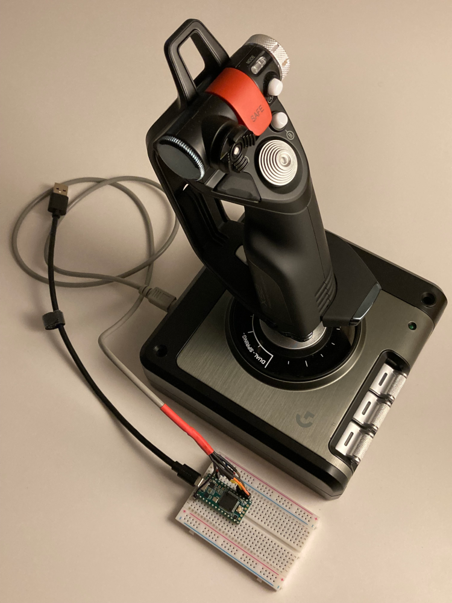

# X52 HOTAS

Arduino library to interface with the X52 HOTAS through its PS/2 connector. Supports both the Pro and non-Pro versions of the hardware.

This work is based on my X52 Pro HOTAS that was purchased new in June 2020. It covers an old X52 (non-Pro) joystick too that I could pick up for pennies because it was sold for parts without the throttle.

## Documentation

My Pro throttle isn't compatible with my non-Pro joystick: they have the same [PS/2 pinout](./docs/img/ps2_female_socket_pinout.png) but speak slightly different protocols. Not too surprising as they were designed and released years apart with different feature sets.

- [X52 Pro](./docs/X52-Pro.md):

    - The wire protocol over the PS/2 ([6-pin mini-DIN](https://en.wikipedia.org/wiki/Mini-DIN_connector)) cable between the X52 Pro throttle and joystick
    - The wire protocol between the two MCUs of the X52 Pro joystick (one in the base and one in the handle)

- [X52](./docs/X52.md) (non-Pro):

    - The wire protocol over the PS/2 (6-pin mini-DIN) cable between the X52 non-Pro throttle and joystick

*We don't know how often (if ever) the X52 firmware changed in the past 15+ years. Your X52 may use a slightly different protocol than the one described and implemented here.*

## Firmware source code for Arduino-compatible boards

**USE THIS AT YOUR OWN RISK AND ONLY IF YOU KNOW WHAT YOU ARE DOING. EVERYTHING IN THIS REPO COMES WITHOUT SUPPORT.**

This repo can be installed to the Arduino IDE as a library (use google to figure out how). After installation the following examples should appear under the `File | Examples | X52 HOTAS` menu of the IDE:

- [X52 Pro](./examples/X52-Pro):

    - [Fake X52 Pro Throttle](./examples/X52-Pro/Fake-X52-Pro-Throttle/Fake-X52-Pro-Throttle.ino) that can communicate with the X52 Pro joystick through its PS/2 connector
    - [Fake X52 Pro Joystick](./examples/X52-Pro/Fake-X52-Pro-Joystick/Fake-X52-Pro-Joystick.ino) that can communicate with the X52 Pro throttle through its PS/2 connector

- [X52](./examples/X52) (non-Pro):

    - [Fake X52 Throttle](./examples/X52/Fake-X52-Throttle/Fake-X52-Throttle.ino) that can communicate with the X52 non-Pro joystick through its PS/2 connector
    - [Fake X52 Joystick](./examples/X52/Fake-X52-Joystick/Fake-X52-Joystick.ino) that can communicate with the X52 non-Pro throttle through its PS/2 connector

## Mission Complete

The primary objective of this project was to make it possible to use my X52 Pro joystick without the throttle unit. Below is a photo of a fully functional prototype that needs only cosmetic improvements. Nothing was changed inside the joystick - the USB capability is provided by a small [PJRC teensy](https://www.pjrc.com/teensy/) 3.2 board (or its low cost alternative: the teensy LC) running a customised version of the "Fake X52 Pro Throttle" firmware:

